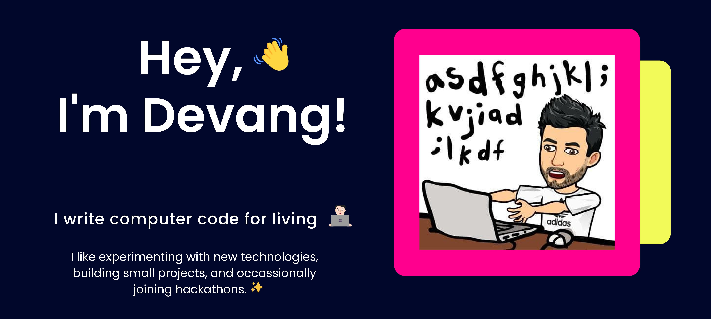

  

<h2 align="left">About Me 💁🏻‍♂️</h2>
<!-- <h1 align="center">Hi 👋, I'm Devang Tomar</h1> -->
<!-- <h3 align="center">Senior Software Engineer working in Bangalore, India</h3> -->

  

- 🔭 I’m currently working as a **Software engineer III** at <a href="https://careers.walmart.com/technology">**Walmart**</a>.

- 🌱 I’m currently exploring Platform Engineering and occasionally Backend Development.

- 👨‍💻 Love writing blogs.. find all of my [**blogs here**](https://dev.to/devangtomar).

<!-- - 📝 I regularly write articles on [blog](https://devangtomar.medium.com/) -->

- 🌨️ Interested in everything Cloud Native.

- ❤️ Love Open Source Software.

- 📄 Know about my experiences [**resume**](https://drive.google.com/file/d/1IHLiohZ01EeT1DngaOzX1uEdWEdPz8bR/view).

 

<h3 align="left">🔗 Connect with Me on Social Media 🔍</h3> 

<!--  -->

 

Some other facts about me-e-e

 
<h3 align="left">Languages and Tools:</h3> 

                       

 

 

&nbsp;

 

